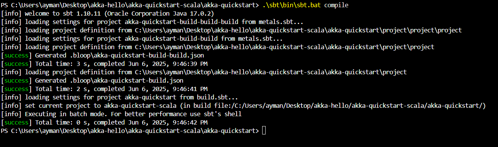
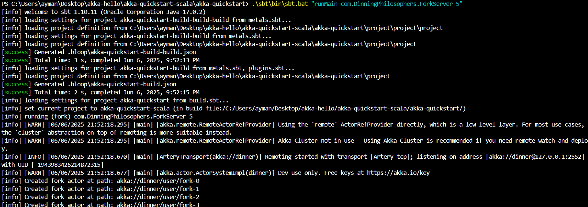
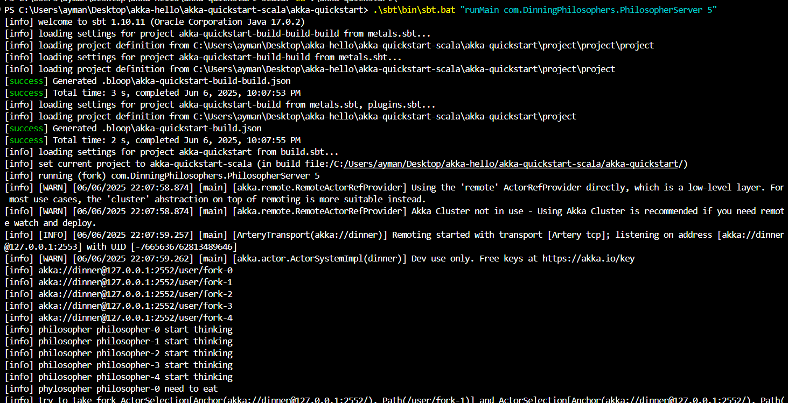
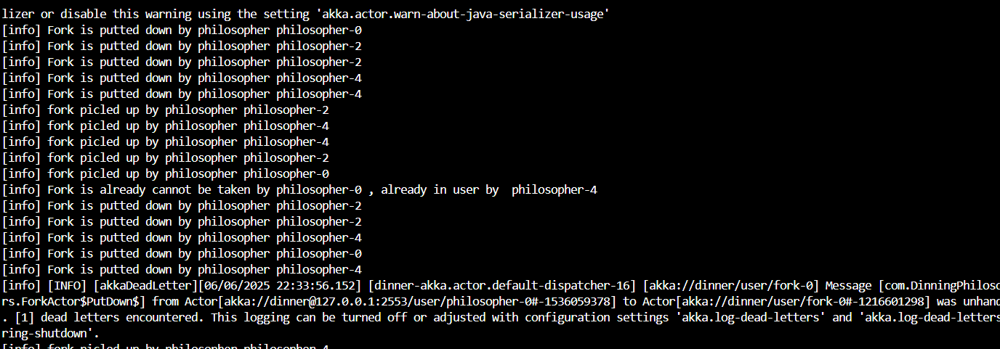
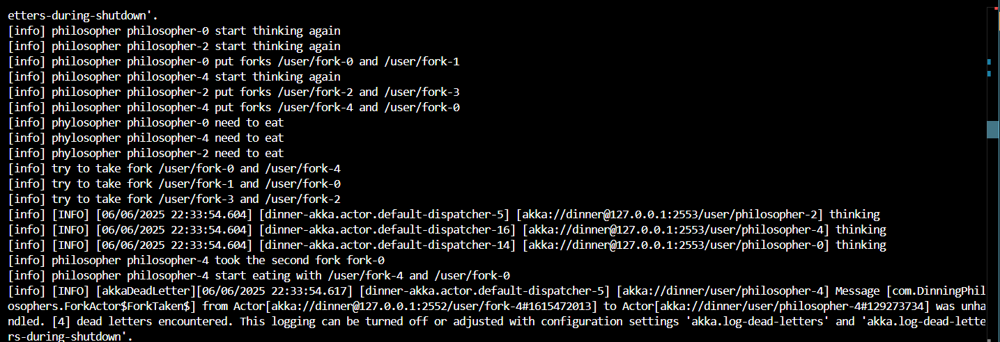
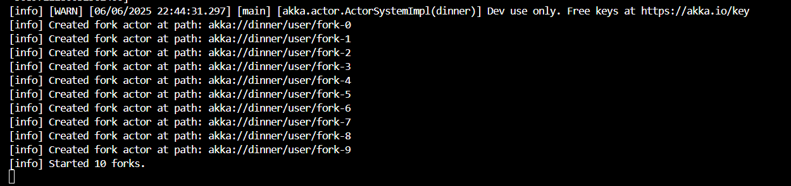
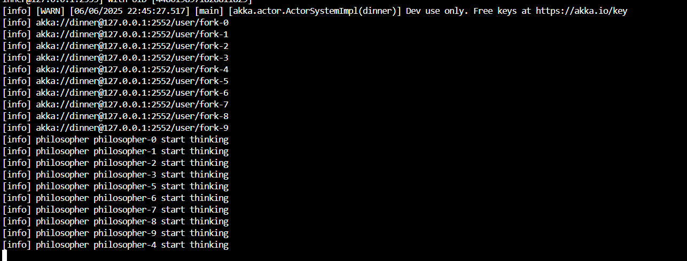
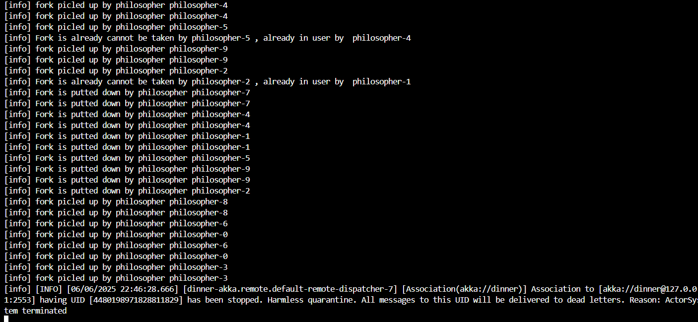
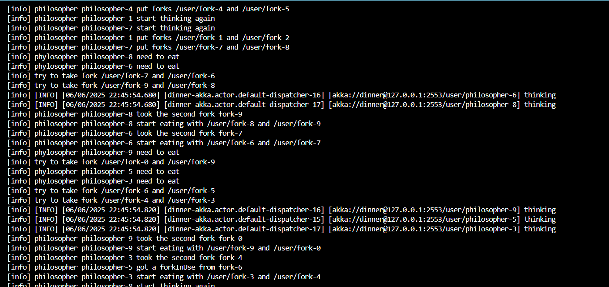

# Dining Philosophers Problem - Akka Scala Implementation

**Author:** ZAHIR Ayman  
**Version:** 1.0  
**Date:** 2025

## Table of Contents
1. [Overview](#overview)
2. [Problem Description](#problem-description)
3. [Implementation Structure](#implementation-structure)
4. [Key Features](#key-features)
5. [Files Description](#files-description)
6. [Running the Implementation](#running-the-implementation)
7. [Deadlock Analysis](#deadlock-analysis)
8. [Prevention Mechanisms](#prevention-mechanisms)
9. [Verification Results](#verification-results)

## Overview
The Dining Philosophers Problem is a foundational exercise in concurrent and distributed systems, illustrating the challenges of resource sharing, synchronization, and deadlock avoidance. This project provides a practical implementation of the problem using Akka actors in Scala, leveraging the Actor model to manage concurrency and inter-process communication. By distributing philosophers and forks across separate servers, the solution demonstrates how modern actor-based frameworks can address classic synchronization issues in a scalable and fault-tolerant manner. The following documentation details the system architecture, implementation strategies, and verification results, offering insights into both the theoretical and practical aspects of distributed concurrency control.

## Problem Description

The Dining Philosophers Problem is a classic synchronization problem in computer science that illustrates common issues in concurrent programming:

- **N philosophers** sit around a circular table
- **N forks** are placed between adjacent philosophers
- Each philosopher alternates between **thinking** and **eating**
- To eat, a philosopher needs **both adjacent forks**
- The challenge is to design a protocol that avoids **deadlock** and **starvation**

### Classical Issues
1. **Deadlock**: All philosophers pick up their left fork simultaneously
2. **Starvation**: Some philosophers may never get to eat
3. **Resource Contention**: Multiple philosophers competing for the same forks

## Implementation Structure

```
akka-quickstart/
├── src/
│   ├── main/
│   │   ├── scala/
│   │   │   └── com/
│   │   │       └── DinningPhilosophers/
│   │   │           ├── ForkActor.scala          # Fork actor implementation
│   │   │           ├── PhilosopherActor.scala   # Philosopher actor implementation
│   │   │           ├── ForkServer.scala         # Fork server main
│   │   │           └── PhilosopherServer.scala  # Philosopher server main
│   │   └── resources/
│   │       ├── fork.conf                        # Fork server configuration
│   │       └── philosopher.conf                 # Philosopher server configuration


## Implementation Visualizer
Below is a visual representation of the distributed actor system architecture. The diagram illustrates the remote communication between Fork actors (running on port 2552) and Philosopher actors (running on port 2553).

```
```|
┌─────────────────────┐    Remote Communication    ┌─────────────────────┐
│   Fork Server       │◄──────────────────────────►│ Philosopher Server  │
│   (Port 2552)       │         Akka TCP           │   (Port 2553)       │
│                     │                            │                     │
│ ┌─────────────────┐ │                            │ ┌─────────────────┐ │
│ │   Fork-0        │ │                            │ │ Philosopher-0   │ │
│ │   Fork-1        │ │                            │ │ Philosopher-1   │ │
│ │   Fork-2        │ │                            │ │ Philosopher-2   │ │
│ │   Fork-3        │ │                            │ │ Philosopher-3   │ │
│ │   Fork-4        │ │                            │ │ Philosopher-4   │ │
│ └─────────────────┘ │                            │ └─────────────────┘ │
└─────────────────────┘                            └─────────────────────┘
```

## Key Features

### Distributed Actor System
- **Remote Actors**: Forks and Philosophers run on separate JVMs
- **Scalability**: Easy to add more philosophers or forks

### Deadlock Prevention
- **Timeout Mechanisms**: Philosophers don't wait indefinitely
- **Resource Release**: Proper cleanup when fork acquisition fails
- **State Management**: Careful tracking of actor states
- **Message Ordering**: Structured message flow between actors

## Files Description

### `ForkActor.scala` - Fork Resource Management
Implements the fork as a stateful actor that can be picked up and put down.

**Key Features:**
- **State Management**: Available/Taken states using `context.become`
- **Ownership Tracking**: Remembers which philosopher holds the fork
- **Message Handling**: PickUp, PutDown, and response messages

**Critical Fork Logic:**
```scala
def available: Receive = {
  case PickUp => 
    println(s"fork picked up by philosopher ${sender().path.name}")
    sender ! ForkTaken
    context.become(taken(sender))
}

def taken(philosopher: ActorRef): Receive = {
  case PickUp => 
    println(s"Fork already in use by ${philosopher.path.name}")
    sender ! ForkInUse
  case PutDown => 
    if(sender == philosopher) {
      println(s"Fork put down by philosopher ${philosopher.path.name}")
      context.become(available)
    }
}
```

### `PhilosopherActor.scala` - Philosopher Behavior
Implements philosopher logic with thinking, eating, and fork acquisition.

**Key Features:**
- **State Machine**: Thinking/Eating states with proper transitions
- **Remote Fork Access**: Uses ActorSelection for distributed forks
- **Timeout Handling**: Prevents indefinite waiting
- **Backoff Strategy**: Delays between attempts to reduce contention

**Critical Philosopher Logic:**
```scala
def takeForks = {
  println(s"try to take fork ${rightFork} and ${leftFork}")
  rightFork ! PickUp
  leftFork ! PickUp
}

private def handleMissingFork(fork: ActorRef) = {
  println(s"philosopher ${self.path.name} got a forkInUse from ${fork.path.name}")
  putForks
  Thread.sleep(10000) // Backoff to reduce contention
  self ! Think
}
```

### Server Applications

#### `ForkServer.scala` - Fork Server Main
Creates and manages fork actors on the remote system.

```scala
object ForkServer {
  def main(args: Array[String]): Unit = {
    val n = if (args.nonEmpty) args(0).toInt else 5
    val system = ActorSystem("dinner", ConfigFactory.load("fork.conf"))
    for (i <- 0 until n) {
      val fork = system.actorOf(Props[ForkActor], s"fork-$i")
      println(s"Created fork actor at path: ${fork.path}")
    }
    println(s"Started $n forks.")
  }
}
```

#### `PhilosopherServer.scala` - Philosopher Server Main
Creates philosopher actors and connects them to remote forks.

```scala
object PhilosopherServer {
  def main(args: Array[String]): Unit = {
    val n = if (args.nonEmpty) args(0).toInt else 5
    val system = ActorSystem("dinner", ConfigFactory.load("philosopher"))
    
    val philosophers = for (i <- 0 until n) yield {
      val leftFork = system.actorSelection(s"akka://dinner@$forkHost:$forkPort/user/fork-$i")
      val rightFork = system.actorSelection(s"akka://dinner@$forkHost:$forkPort/user/fork-${(i + 1) % n}")
      system.actorOf(Props(new PhilosopherActor(leftFork, rightFork)), s"philosopher-$i")
    }
    
    philosophers.foreach(_ ! Think)
  }
}
```

### Configuration Files

#### `fork.conf` - Fork Server Configuration
```hocon
akka {
  actor {
    provider = "akka.remote.RemoteActorRefProvider"
    allow-java-serialization = on  
  }
  remote.artery {
    canonical.hostname = "127.0.0.1"
    canonical.port = 2552
  }
}
```

#### `philosopher.conf` - Philosopher Server Configuration
```hocon
akka {
  actor {
    provider = "akka.remote.RemoteActorRefProvider"
    allow-java-serialization = on
  }
  remote.artery {
    canonical.hostname = "127.0.0.1"
    canonical.port = 2553
  }
}
```

## Running the Implementation

### Prerequisites

**Bundled SBT:**  
This project includes a local SBT installation in the `sbt` directory. You do not need to install SBT globally. Use the provided batch scripts or run SBT directly from the included path.

To run the simulation, ensure you have **Java 17** and **SBT** installed on the system.

```bash
# Check Java version (should be 17)
java -version

sbt --version
```

### Compilation Commands

```bash
# Navigate to project directory
cd c:\Users\ayman\Desktop\akka-hello\akka-quickstart-scala\akka-quickstart

# Compile the project
.\sbt\bin\sbt.bat compile
```

### Running the Distributed System

**Step 1: Start Fork Server (Terminal 1)**
```bash
#directly with sbt
.\sbt\bin\sbt.bat "runMain com.DinningPhilosophers.ForkServer 5"
```


**Step 2: Start Philosopher Server (Terminal 2)**

```bash
# Or directly with sbt
.\sbt\bin\sbt.bat "runMain com.DinningPhilosophers.PhilosopherServer 5"
```


### Expected Outputs

**Fork Server:**


**Philosopher Server:**
 put down by philosopher philosopher-0


## Deadlock Analysis

### 1. How Deadlocks Are Prevented

Deadlocks are prevented using a combination of timeout mechanisms and backoff strategies. Each philosopher, when attempting to acquire forks, does not wait indefinitely. If a fork is unavailable (already in use), the philosopher releases any held forks, waits for a specified backoff period (thinking state) , and then retries. This approach breaks the circular wait condition that typically leads to deadlock.

**Key Techniques:**
- **Timeouts:** Philosophers schedule retries instead of blocking.
- **Backoff:** After a failed attempt, philosophers wait before retrying, reducing contention.
- **Resource Release:** Held forks are always released if both cannot be acquired.

**Relevant Code:**
```scala
case ForkInUse =>
    handleMissingFork(sender) // Releases forks and waits before retrying
```

### 3. Expected Outcome

**terminal 1**
philosopher pickup forks , eat and put them and go thinking again


**terminal 2**
forks picked up by philosophers and puted down after eating 


This confirms that all philosophers have eaten at least once, and the system avoids deadlock by design.

#### Timeout-Based Detection
```scala
// Philosophers don't wait indefinitely
private def think(duration: FiniteDuration) = {
  context.system.scheduler.scheduleOnce(duration, self, Eat)
  context.become(thinking)
}

// Backoff strategy reduces contention
Thread.sleep(10000) // Wait before retrying
```
## Prevention Mechanisms

### Timeout-Based Prevention

The key prevention strategy uses timeouts and backoff to avoid indefinite waiting:

```scala
private def handleMissingFork(fork: ActorRef) = {
  println(s"philosopher ${self.path.name} got a forkInUse")
  putForks  // Release any held forks
  Thread.sleep(10000)  // Backoff period
  self ! Think  // Return to thinking state
}
```

### Proper Resource Cleanup

When fork acquisition fails, philosophers properly release held resources:

```scala
def putForks = {
  rightFork ! PutDown
  leftFork ! PutDown
}

// Called whenever a fork is denied
case ForkInUse => 
  handleMissingFork(sender)
```

## Scalability: Arbitrary Number of Philosophers and Forks

The implementation supports any number of philosophers and forks. You can specify the desired count as a command-line argument when starting the servers. For example, running with 10 philosophers and 10 forks:

```bash
.\sbt\bin\sbt.bat "runMain com.DinningPhilosophers.ForkServer 10"
.\sbt\bin\sbt.bat "runMain com.DinningPhilosophers.PhilosopherServer 10"
```

The system will automatically create the specified number of actors and manage their interactions without modification to the code.
### running servers
***forks***


***philosophers***


### results

***forks***


***philosophers***



## Verification Results

### Safety Properties 
- **Mutual Exclusion**: Fork actors enforce single ownership
- **Resource Consistency**: Proper pickup/putdown sequences
- **State Invariants**: Actor state transitions are atomic

### Liveness Properties 
- **Deadlock Freedom**: Timeout mechanisms prevent circular wait
- **Starvation Prevention**: Backoff strategy ensures fair access
- **Progress**: System continues to make progress over time

### Performance Characteristics
- **Distributed Scalability**: Easy to add more nodes
- **Fault Tolerance**: Automatic recovery from actor failures
- **Resource Efficiency**: Lightweight actor model
- **Monitoring**: Built-in logging and state tracking

### System Behavior
- **Normal Operation**: Philosophers successfully acquire forks and eat
- **Contention Handling**: Graceful degradation under high contention
- **Recovery**: Automatic recovery from temporary network issues
- **Shutdown**: Clean termination of both servers
## Conclusion

This project demonstrates a robust, deadlock-free solution to the Dining Philosophers Problem using Akka actors in Scala. Forks and philosophers operate as independent, distributed actors on separate servers, ensuring modularity and scalability. The implementation is dynamic—supporting any number of philosophers and forks—while maintaining correct synchronization and liveness properties. The use of timeouts and backoff strategies guarantees that the system avoids deadlock and starvation, making it suitable for both educational and practical distributed systems scenarios.
